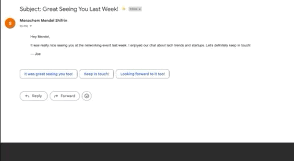

# 📬 AI Email Writer Assistant

**AI Email Writer Assistant** is a Chrome extension powered by a Spring Boot backend that generates professional email replies within Gmail using Gemini AI. It enhances productivity by automating email responses with one click — right inside your Gmail compose window.

---
##  Live Demo

Check out how the extension works in Gmail:



## ✨ Features

- 📥 Detects when you open a Gmail compose window
- 🧠 Injects an "AI Reply" button into Gmail’s toolbar
- 📄 Extracts the content of the email you're replying to
- 🤖 Sends content to a Spring Boot backend using Gemini AI
- 📨 Pastes the generated response directly into the Gmail text box

---

## 🧰 Tech Stack

### 🔹 Frontend (Chrome Extension)
- Vanilla JavaScript (ES6)
- Chrome Extension API (Manifest v3)

### 🔹 Backend (API)
- Java 17
- Spring Boot 3
- Gemini API integration (gemini-2.0-flash)

---

## 🚀 Getting Started

Follow these steps to run the project locally:

---


### 1️⃣ Clone the Repository

```bash
git clone https://github.com/mendel1224/AI-Email-Writer.git
cd AI-Email-Writer
```
### 2️⃣ Set Up the Gemini API Key
To function correctly, the backend must connect to Gemini AI (gemini-2.0-flash) using your own API key.

🔑 Get your API key
Go to Google AI Studio

Create a project (if needed)

Generate your Gemini API key

⚙️ Add the key as an environment variable in IntelliJ
In IntelliJ, open the email-writer Spring Boot module

Go to Run → Edit Configurations...

Under the "Environment Variables" section, add:


GEMINI_KEY=your_api_key_here  
GEMINI_URL=https://generativelanguage.googleapis.com/v1beta/models/gemini-2.0-flash:generateContent?=    

These variables are used in application.properties:

gemini.api.key = ${GEMINI_KEY}   
gemini.api.url = ${GEMINI_URL}
### 3️⃣ Run the Backend (Spring Boot)
Make sure Java 17+ is installed.

### 4️⃣ Load the Chrome Extension
Open Google Chrome

Visit chrome://extensions

Enable Developer Mode (top-right toggle)

Click "Load unpacked"

Select the email-writer-extension/ folder

✅ The extension should now appear in your extensions list.

### 5️⃣ Test the Extension in Gmail
Go to https://mail.google.com

Click “Compose” to open a new email

Wait for the “AI Reply” button to appear in the Gmail toolbar

Click the button — the extension will:

1) Extract the email content

2) Send it to your local backend

3) Use Gemini AI to generate a reply

4) Insert the reply directly into your compose box

